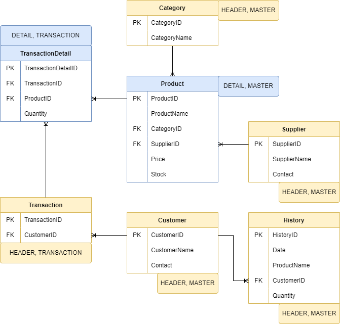

<div align="center">
 
  <h2 align="center">Toko Kelontong</h2>
  <h4 align="center">mini-project</h4>

</div>

## Entitry Relationship Diagram

<div align="center">
  
</div>

## About The Toko Kelontong
This mini-project has been build to inventory collection of Toko Kelontong.

Inventory data:
* Category
* Customer
* History
* Product
* Supplier
* Transaction and Transaction Detail

## Built With
* Spring IoC
* Java Stream
* Native SQL Query

## Variables

| Key | Value | Type |
| --- | ------|-------------|
| base_url | http://localhost:6060/kelontong | string |


## Endpoints

* [Category](#category)
    1. [Find All](#1-find-all)
    1. [Insert](#2-insert)
    1. [Update](#3-update)
    1. [Delete](#4-delete)
    1. [Count Category](#5-count-category)
* [Supplier](#supplier)
    1. [Find All](#1-find-all-1)
    1. [Insert](#2-insert-1)
    1. [Update](#3-update-1)
    1. [Delete](#4-delete-1)
    1. [Count Supplier](#5-count-supplier)
* [Customer](#customer)
    1. [Find All](#1-find-all-2)
    1. [Insert](#2-insert-2)
    1. [Update](#3-update-2)
    1. [Delete](#4-delete-2)
    1. [Count Customer](#5-count-customer)
* [Product](#product)
    1. [Find All](#1-find-all-3)
    1. [Insert](#2-insert-3)
    1. [Update](#3-update-3)
    1. [Delete](#4-delete-3)
    1. [Count Product](#5-count-product)
* [Transaction](#transaction)
    1. [Find All](#1-find-all-4)
    1. [Insert](#2-insert-4)
    1. [Delete](#3-delete)
* [TransactionDetail](#transactiondetail)
    1. [Find All](#1-find-all-5)
    1. [Insert](#2-insert-5)
    1. [Update](#3-update-4)
    1. [Delete](#4-delete-4)
* [History](#history)
    1. [Find All](#1-find-all-6)
    1. [Insert](#2-insert-6)
    1. [Update](#3-update-5)
    1. [Delete](#4-delete-5)

--------


## Category


### 1. Find All


***Endpoint:***

```bash
Method: GET
Type: 
URL: {{base_url}}/category/find-all-category
```


### 2. Insert


***Endpoint:***

```bash
Method: POST
Type: RAW
URL: {{base_url}}/category
```


***Body:***

```js        
{
    "categoryID" : "4",
    "categoryName" : "Botol"
}
```


### 3. Update


***Endpoint:***

```bash
Method: PUT
Type: 
URL: {{base_url}}/
```


### 4. Delete


***Endpoint:***

```bash
Method: DELETE
Type: 
URL: {{base_url}}/category
```


***Query params:***

| Key | Value | Description |
| --- | ------|-------------|
| id |  |  |


### 5. Count Category


***Endpoint:***

```bash
Method: GET
Type: 
URL: 
```


## Supplier


### 1. Find All


***Endpoint:***

```bash
Method: GET
Type: 
URL: {{base_url}}/find-all-supplier
```


### 2. Insert


***Endpoint:***

```bash
Method: POST
Type: 
URL: {{base_url}}/supplier
```


### 3. Update


***Endpoint:***

```bash
Method: PUT
Type: RAW
URL: {{base_url}}/supplier
```


***Body:***

```js        
{
    "id" : "",
    "name" : "",
    "contact" : ""
}
```


### 4. Delete


***Endpoint:***

```bash
Method: DELETE
Type: 
URL: {{base_url}}/supplier
```


***Query params:***

| Key | Value | Description |
| --- | ------|-------------|
| id |  |  |


### 5. Count Supplier


***Endpoint:***

```bash
Method: GET
Type: 
URL: 
```


## Customer


### 1. Find All


***Endpoint:***

```bash
Method: GET
Type: 
URL: {{base_url}}/customer/find-all-customer
```


### 2. Insert


***Endpoint:***

```bash
Method: POST
Type: RAW
URL: {{base_url}}/customer
```


***Body:***

```js        
{
    "name" : "Tama",
    "contact" : "08587771123"
}
```


### 3. Update


***Endpoint:***

```bash
Method: PUT
Type: RAW
URL: {{base_url}}/customer/2
```


***Body:***

```js        
{
    "name" : "test update done",
    "contact" : "newTest123"
}
```


### 4. Delete


***Endpoint:***

```bash
Method: DELETE
Type: 
URL: {{base_url}}/customer
```


### 5. Count Customer


***Endpoint:***

```bash
Method: GET
Type: 
URL: 
```


## Product


### 1. Find All


***Endpoint:***

```bash
Method: GET
Type: 
URL: {{base_url}}/product/find-all-product
```


### 2. Insert


***Endpoint:***

```bash
Method: POST
Type: RAW
URL: {{base_url}}/product
```


***Body:***

```js        
{
    "name" : "Indomie",
    "price" : "3000",
    "stock" : "12"
}
```


### 3. Update


***Endpoint:***

```bash
Method: PUT
Type: RAW
URL: {{base_url}}/product/1
```


### 4. Delete


***Endpoint:***

```bash
Method: DELETE
Type: 
URL: {{base_url}}/product
```


### 5. Count Product


***Endpoint:***

```bash
Method: GET
Type: 
URL: 
```


## Transaction


### 1. Find All


***Endpoint:***

```bash
Method: GET
Type: 
URL: {{base_url}}/transaction/find-all-transaction
```


### 2. Insert


***Endpoint:***

```bash
Method: POST
Type: RAW
URL: {{base_url}}/transaction
```


***Body:***

```js        
{
    "customerId" : "1"
}
```


### 3. Delete


***Endpoint:***

```bash
Method: DELETE
Type: 
URL: {{base_url}}/transaction
```


***Query params:***

| Key | Value | Description |
| --- | ------|-------------|
| id |  |  |


## TransactionDetail


### 1. Find All


***Endpoint:***

```bash
Method: GET
Type: 
URL: {{base_url}}/detail/find-all-detail
```


### 2. Insert


***Endpoint:***

```bash
Method: POST
Type: RAW
URL: {{base_url}}/detail
```


***Body:***

```js        
{
    "transactionId" : "2",
    "productId" : "2",
    "quantity" : "10"
}
```


### 3. Update


***Endpoint:***

```bash
Method: PUT
Type: 
URL: {{base_url}}/detail/1
```


### 4. Delete


***Endpoint:***

```bash
Method: DELETE
Type: 
URL: {{base_url}}/detail
```


***Query params:***

| Key | Value | Description |
| --- | ------|-------------|
| id |  |  |


## History


### 1. Find All


***Endpoint:***

```bash
Method: GET
Type: 
URL: 
```


### 2. Insert


***Endpoint:***

```bash
Method: POST
Type: RAW
URL: {{base_url}}/history
```


***Body:***

```js        
{
    "productName" : "Rinso",
    "customerId" : "2",
    "quantity" : "2"
}
```


### 3. Update


***Endpoint:***

```bash
Method: PUT
Type: 
URL: {{base_url}}/history/3
```


### 4. Delete


***Endpoint:***

```bash
Method: DELETE
Type: 
URL: {{base_url}}/history
```


***Query params:***

| Key | Value | Description |
| --- | ------|-------------|
| id |  |  |


---
[Back to top](#toko-kelontong)
